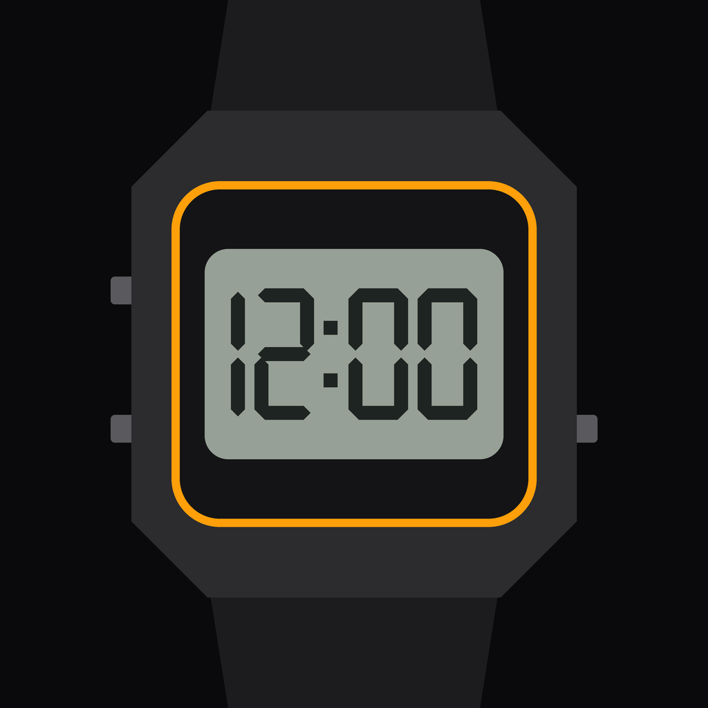

<p align="center">
  
</p>

<h1 align="center">Hour Sync</h1>

<p align="center">Unofficial iOS app for the Casio ABL-100WE watch, built on the protocol work of <a href="https://github.com/izivkov/GShockAPI">GShockAPI</a> by Ivo Zivkov.</p>

---

Hour Sync connects to the Casio ABL-100WE over Bluetooth LE without the official app. It syncs the time, manages alarms, settings and the timer, reads the step counter, and turns the watch buttons into triggers for actions on the iPhone.

## Features

| Feature | Status |
|---|---|
| Connection and automatic reconnection, also in the background | ✅ tested on the watch |
| App restored by iOS in the background (`willRestoreState`) | ✅ tested |
| Detecting which button started the connection | ✅ lower left, lower right, lower right long press |
| Time sync on every connection, and manually with **Sync time** | ✅ tested |
| World time: send the time of any city to the watch | ✅ tested |
| Alarms (5) and hourly chime | ✅ tested |
| Watch settings: 12/24 h, button tone, power saving, light duration | ✅ tested |
| Auto time adjustment (minute of the hourly sync) | reading tested, writing not yet verified |
| Watch timer `0x18` | ✅ tested |
| Countdown from the app (uses alarm 5 of the watch) | ✅ tested |
| Steps (lifelog): today, hourly chart and previous days, with distance | ✅ tested (order of the 7 daily summaries not yet verified) |
| Long press: find iPhone or play an Apple Music song | ✅ tested |
| Battery, temperature, reminders, world cities | ❌ the ABL-100WE doesn't have them (according to GShockAPI) |

The app UI is currently in Spanish.

## How it works

The watch is not connected all the time. When you press a button, it advertises over BLE and the app connects, performs the handshake, syncs the time, reads steps, alarms, settings and the timer, and records the button. The watch closes the connection about 55 seconds later.

The app saves the watch identifier and leaves a pending `connect()` that never expires and works in the background, so every button press reconnects without opening the app. **Disconnect** turns that off and **Connect watch** turns it back on.

Protocol details: [PROTOCOL.md](PROTOCOL.md).

## Build

Requirements: Xcode 15+ and a **real iPhone** (the simulator has no Bluetooth). Deployment target: iOS 16.

1. Open `CasioABL100/CasioABL100.xcodeproj`.
2. Target **CasioABL100** → *Signing & Capabilities* → choose your Team. Change the bundle ID if needed.
3. Run on the iPhone (⌘R) and accept the Bluetooth and notification permissions.
4. With the app open, press the lower left button of the watch.

**Before `git pull`:** Xcode rewrites `project.pbxproj` when it opens it (long format, "Recovered References" group, your Team), and that blocks the pull. If you have no changes of your own to keep, close Xcode and run:

```bash
git checkout -- CasioABL100/CasioABL100.xcodeproj/project.pbxproj
git pull
```

## Logs

In Debug builds every important event has the prefix `🔵 [NUESTRA_APP <seconds>]`: `[CONNECTED]`, `[ARMED]`, `[RESTORE]`, `[TIME_SYNC]`, `[STEPS]`, `[ALARMS]`, `[WATCH_ERROR]`, `[WRITE_FAILED]`…

- In the Xcode console: filter by `NUESTRA_APP`.
- In Console.app (no Xcode, for background tests): subsystem `com.casio.abl100`.

Close the official Casio app before testing: if it is connected at the same time, its requests show up mixed with ours.

## Project structure

```
CasioABL100/CasioABL100/
├── CasioWatchManager/
│   ├── CasioWatchManager.swift   # BLE: connection, handshake, buttons, time sync, reads and writes
│   ├── WatchRequestQueue.swift   # GET/SET queue, one request in flight at a time
│   ├── StepCounter.swift         # lifelog transaction (0x23/0x24) and parser
│   ├── StepHistory.swift         # step history stored on the iPhone
│   ├── Alarms.swift              # alarms 0x15/0x16
│   ├── Settings.swift            # settings 0x13 and auto time adjustment 0x11
│   ├── WatchTimer.swift          # timer 0x18
│   ├── FindPhone.swift           # find iPhone (local notifications with sound)
│   └── LongPressAction.swift     # long press action: find iPhone or play a song
├── UI/                           # SwiftUI: Watch, Alarms, Steps, Timer and Settings tabs
├── Info.plist                    # Bluetooth permissions + background mode
└── PrivacyInfo.xcprivacy
```

## Credits

This project would not exist without the work of **[Ivo Zivkov](https://github.com/izivkov)**:

- **[GShockAPI](https://github.com/izivkov/GShockAPI)**: the Kotlin library that documents the Casio BLE protocol and supports the ABL-100WE (`WatchModel.ABL_100`). Hour Sync ports these parts of it to Swift:
  - `TimeIO` → time sync
  - `ButtonPressedIO` → button detection
  - `AlarmsIO`, `model/Alarms.kt` → alarms
  - `SettingsIO`, `TimeAdjustmentIO` → settings and auto time adjustment
  - `TimerIO` → timer
  - `StepCounterIO` → steps
- **[gshock_api](https://github.com/izivkov/gshock_api)**: the Python version, used as a reference for the lifelog (`step_counter_io.py`).
- **[G-Shock Smart Sync](https://github.com/izivkov/CasioGShockSmartSync)**: the Android app built on GShockAPI. No code from it was used; the Hour Sync UI was written from scratch.

GShockAPI and gshock_api are released under the MIT License. Their copyright notice is in [THIRD_PARTY_NOTICES.md](THIRD_PARTY_NOTICES.md).

## License

MIT, see [LICENSE](LICENSE). Third-party notices in [THIRD_PARTY_NOTICES.md](THIRD_PARTY_NOTICES.md).

## Disclaimer

Hour Sync is an independent project. It is not affiliated with, endorsed by or sponsored by Casio Computer Co., Ltd. "Casio" and "G-Shock" are trademarks of Casio Computer Co., Ltd., used here only to describe compatibility.
